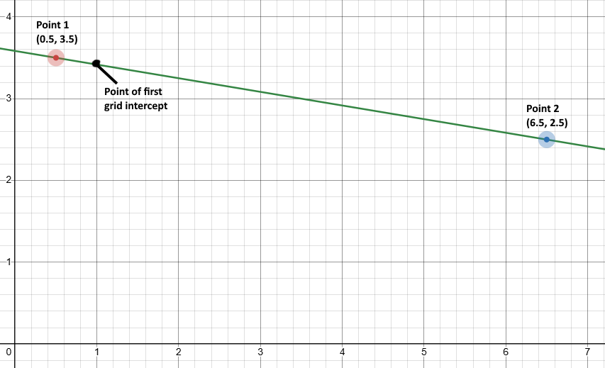
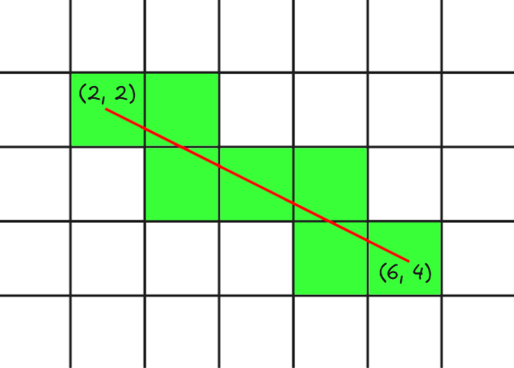
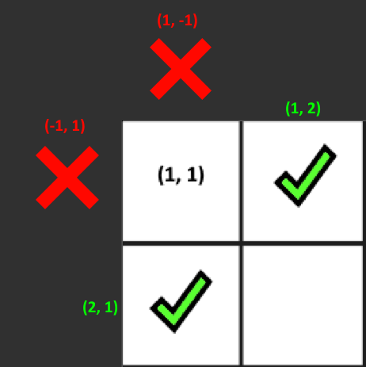

_**@Author:** [William J. Horn](https://github.com/william-horn)_

# _class_ `CellGrid`

The `CellGrid` class creates a virtual 2D grid, bounded by a given `<x, y>` dimension. Instead of implementing a 2D array, this grid uses a `HashMap` and maps `Unit2` points to their corresponding `Cell` objects.

This choice was made for two reasons:

1. This allows `CellGrid` to store cell data in points that are off the grid, in cases where we may want cell data to exist outside of rendered or functional view. Such cells are marked with a special `CellType` called `OUT_OF_BOUNDS` that can be checked for.

2. It's more convenient to use the `HashMap` API to query the grid for a given cell than constantly indexing a 2D array.

## Version 0.2.1
##### [William J. Horn](https://github.com/william-horn) - *4/11/2025*

Major changes.

* **Added** more grid-querying methods for getting random cells, available cells, or both. Such methods include:
	* [`CellGrid.getCells()`](https://github.com/Pazmazz/predator-prey-sim/blob/main/src/classes/entity/CellGrid.java#L607)
		- *returns all `Cell` objects on the grid as an `ArrayList<Cell>` object*

	* [`CellGrid.getAvailableCells()`](https://github.com/Pazmazz/predator-prey-sim/blob/main/src/classes/entity/CellGrid.java#L749)
		- *returns all available (non-occupied and in-bounds) cells on the virtual grid.*

	* [`CellGrid.getRandomCell()`](https://github.com/Pazmazz/predator-prey-sim/blob/main/src/classes/entity/CellGrid.java#L759)
		- *returns a random `Cell` object on the virtual grid (does not check if it's available)*

	* [`CellGrid.getRandomCells()`](https://github.com/Pazmazz/predator-prey-sim/blob/main/src/classes/entity/CellGrid.java#L782)
		- *returns all `Cell` objects on the grid in random order as an `ArrayList<Cell>` object*

	* [`CellGrid.getRandomAvailableCell()`](https://github.com/Pazmazz/predator-prey-sim/blob/main/src/classes/entity/CellGrid.java#L770)
		- *returns a random available `Cell` object on the virtual grid only if it is available (non-occupied and in-bounds)*

	* [`CellGrid.getRandomCells(amount)`](https://github.com/Pazmazz/predator-prey-sim/blob/main/src/classes/entity/CellGrid.java#L795)
		- *returns an `ArrayList<Cell>` of random `Cell` objects on the grid, quantified by the `amount` parameter.*

	* [`CellGrid.getRandomCellsFrom(ArrayList<Cell>, amount)`](https://github.com/Pazmazz/predator-prey-sim/blob/main/src/classes/entity/CellGrid.java#L697)
		- *returns an `ArrayList<Cell>` of random `Cell` objects from a provided `ArrayList<Cell>` of `Cell` objects.*

	* [`CellGrid.getRandomCellFrom(ArrayList<Cell>)`](https://github.com/Pazmazz/predator-prey-sim/blob/main/src/classes/entity/CellGrid.java#L640)
		- *returns a random cell from a provided array list of `Cell` objects (does not check it's available)*

	* [`CellGrid.getAvailableCellsFrom(ArrayList<Cell>)`](https://github.com/Pazmazz/predator-prey-sim/blob/main/src/classes/entity/CellGrid.java#L620)
		- *returns all available (non-occupied and in-bounds) cells from a provided array list of `Cell` objects.*

	* [`CellGrid.getRandomAvailableCellsFrom(ArrayList<Cell>, amount)`](https://github.com/Pazmazz/predator-prey-sim/blob/main/src/classes/entity/CellGrid.java#L719)
		- *returns an `ArrayList<Cell>` of random available (non-occupied and in-bounds) `Cell` objects within a provided `ArrayList<Cell>`, quantified by the `amount` parameter*

* **Added** special query methods for computing path cells intersecting with a line. Methods include:
	- [`CellGrid.getCellPathIterator(Vector2 from, Vector2 to)`](https://github.com/Pazmazz/predator-prey-sim/blob/main/src/classes/entity/CellGrid.java#L885)
		- *returns an `Iterator<Cell>` iterator which will incrementally compute the next grid cell on the line starting at `from` and ending at `to` on every `CellPathIterator.next()` call.*

	- [`CellGrid.getCellPath(Vector2 from, Vector2 to)`](https://github.com/Pazmazz/predator-prey-sim/blob/main/src/classes/entity/CellGrid.java#L861)
		- *returns an `ArrayList<Cell>` of cell objects intersecting with the line starting at `from` and ending at `to`, all at once*

	- [`CellGrid.getGridIntercept(Vector2 from, Vector2 to)`](https://github.com/Pazmazz/predator-prey-sim/blob/main/src/classes/entity/CellGrid.java)
		- *returns a `GridIntercept` object with metadata about the first grid cell that the line between `from` and `to` intersects with*

* **Added** other notable utility methods:
	* [`CellGrid.getCellCount()`](https://github.com/Pazmazz/predator-prey-sim/blob/main/src/classes/entity/CellGrid.java)
		- *returns the integer number of `Cell` objects that currently exist on the cell grid*

	* [`CellGrid.getGrid()`](https://github.com/Pazmazz/predator-prey-sim/blob/main/src/classes/entity/CellGrid.java)
		- *returns the object reference to the internal `CellGrid` hashmap*

## Version 0.1.1
##### [William J. Horn](https://github.com/william-horn) - *4/08/2025*

Major changes.

- **Changed** starting unit on the grid from `(0, 0)` to `(1, 1)`.

- **Replaced** `IntVector2` with `Unit2`, so cells can now be accessed by their unit value like such:

  - `CellGrid.getCell(new Unit2(1, 1))`

- **Added method**

  - `CellGrid.outOfBounds(<Cell, Unit2, Vector2>)`
    - Inverted check method for verifying if a cell, cell unit, or cell position is out of bounds. Returns true if the location is out of bounds.

- `Cell.getPosition()` now returns a `Vector2` object representing the cell's actual position on the screen.

- `Cell.getUnit2()` now returns a `Unit2` object, which represents the integer location of the cell on the grid (i.e, `(1, 1)`, `(5, 5)`, etc)

- `GridCell.getCell()` now additionally accepts `Vector2` arguments which will return the cell on the screen at that given point.

<br/>

# Getting Started

First, the following imports are needed to utilize this class:

- `Unit2`

When ready, you can create a `CellGrid` instance by calling the constructor and passing the dimensions of the grid as an `Unit2`:

```java
import classes.entity.Unit2;

// Create a new 10x10 grid
CellGrid grid = new CellGrid(new Unit2(10, 10));
```

By default, the virtual grid is empty and does not contain any points or `Cell` objects. `Cell` objects are only created when you query the virtual grid using `CellGrid.getCell()`

### `CellGrid.getCellGridIntercept()` *Version 0.2.1+*

- **Parameters:**

  - `<Vector2 from>` - _The starting point of the line_
  - `<Vector2 to>` - _The ending point of the line_

- **Returns:** `<GridIntercept metadata>`

Given two points, find and return the next point that intersects the grid lines between those two points, along with metadata about that intersection (such as which `Cell` it collided with)

***Figure 1.***



Considering this graph, `getGridIntercept` will return the first grid line intercept between `Point 1` and `Point 2`. The graph above written in code would look like this:

#### Example:

```java
CellGrid grid = new CellGrid(new Unit2(10, 10));

Vector2 p1 = new Vector2(0.5, 3.5);
Vector2 p2 = new Vector2(6.5, 2.5);

GridIntercept inter = grid.getGridIntercept(p0, p1);

Console.println(inter);
Console.println(inter.getCell());
```

#### Output:

<blockquote>
GridIntercept&lt;Axis: X_GRID, Point: Vector2&lt;1.0, 3.4166666666666665&gt;&gt;
<br/>
Cell&lt;1, 4&gt;
</blockquote>

<br/>

As we can see in ***Figure 1***, the line does indeed pass through the point `<1.0, 3.4166...>`

### `CellGrid.getCellPath()` *Version 0.2.1+*

- **Parameters:**

  - `<Vector2 from>` - *The starting point of the line*
  - `<Vector2 to>` - *The end point of the line*

- **Returns:** `<ArrayList<Cell> cellPath>`

Given two points, iteratively use the `CellGrid.getGridIntercept` method to compute *all* the grid cells that intersect the line starting at `from` and ending at `to`, and return them as an `ArrayList<Cell>` object. 

Consider the following:

***Figure 1.***



<br/>

To compute this cell path in this graphic, we can use the code below:

#### Example:

```java
CellGrid grid = new CellGrid(new Unit2(10, 10));
Cell c0 = grid.getCell(new Unit2(2, 2));
Cell c1 = grid.getCell(new Unit2(6, 4));

ArrayList<Cell> cells = grid.getCellPath(c0, c1);

Console.println(cells);
```

#### Output:
<blockquote>
[Cell<2, 2>, Cell<3, 2>, Cell<3, 3>, Cell<4, 3>, Cell<5, 3>, Cell<5, 4>, Cell<6, 4>]
</blockquote>

<br/>

As you can see, the output indeed shows all `Cell` objects from the starting cell to the ending cell.

### `CellGrid.getCells()` *Version 0.2.1+*
* **Returns:** `<ArrayList<Cell> cells>` - *all the currently existing cells in the virtual grid*

#### Example:
```java
CellGrid grid = new CellGrid(new Unit2(10, 10));

grid.getCell(new Unit2(1, 1));
grid.getCell(new Unit2(2, 2));

Console.println(grid.getCells());
```

#### Output:

<blockquote>
[Cell<1, 1>, Cell<2, 2>]
</blockquote>

### `CellGrid.getRandomCell()` *Version 0.2.1+*

* **Returns:** `<Cell cell>` - *A random `Cell` object that exists within the virtual grid*

This returns any random cell that exists within the virtual grid. It will not perform any availability checks, so using this method you will need to check for `OUT_OF_BOUNDS` and `IS_OCCUPIED` cases.

#### Example:
```java
CellGrid grid = new CellGrid(new Unit2(10, 10));

grid.getCell(new Unit2(1, 1));
grid.getCell(new Unit2(2, 2));
grid.getCell(new Unit2(3, 3));

Console.println(grid.getRandomCell());
Console.println(grid.getRandomCell());
Console.println(grid.getRandomCell());
```

#### Output:

<blockquote>
Cell<2, 2>
<br/>
Cell<1, 1>
<br/>
Cell<3, 3>
</blockquote>

<br>

*These are in random order*

### `CellGrid.getRandomCells()` *Version 0.2.1+*

* **Returns:** `<ArrayList<Cell> cells>` - *a random assortment of all currently existing `Cell` objects in the virtual grid.*


This will return an `ArrayList<Cell>` which contains all currently existing `Cell` objects in the virtual grid, in random order.

#### Example:
```java
CellGrid grid = new CellGrid(new Unit2(10, 10));

grid.getCell(new Unit2(1, 1));
grid.getCell(new Unit2(2, 2));
grid.getCell(new Unit2(3, 3));

Console.println(grid.getRandomCells());
```

#### Output:

<blockquote>
[Cell<3, 3>, Cell<1, 1>, Cell<2, 2>]
</blockquote>

<br>

*These are in random order*

### `CellGrid.getRandomCellFrom()` *Version 0.2.1+*

- **Parameters:**

  - `<ArrayList<Cell> cells>` - *the `ArrayList<Cell>` to choose a random `Cell` object from*

- **Returns:** `<Cell cell>`

This method will return *any* random cell within a provided `ArrayList<Cell>`. It will not check for availability of the cell, it will just choose any cell at random similar to `CellGrid.getRandomCell()`

#### Example:
```java
CellGrid grid = new CellGrid(new Unit2(10, 10));

Cell cell = grid.getCell(new Unit2(1, 1));

// get all cells adjacent to cell (1, 1), which includes:
// (-1, 1), (1, 2), (2, 1), (1, -1)
ArrayList<Cell> adjCells = grid.getCellsAdjacentTo(cell);

Console.println(grid.getRandomCellFrom(adjCells));
Console.println(grid.getRandomCellFrom(adjCells));
Console.println(grid.getRandomCellFrom(adjCells));
```

#### Output:

<blockquote>
Cell<2, 1>
<br>
Cell<-1, 1>
<br>
Cell<1, -1>
</blockquote>

<br/>

*These are in random order.*

### `CellGrid.getRandomCellsFrom()` *Version 0.2.1+*

- **Parameters:**

	- **Overload 1:**

  		- `<ArrayList<Cell> cells>` - *the `ArrayList<Cell>` to choose random `Cell` objects from*
	
	- **Overload 2:**

		- `<ArrayList<Cell> cells>` - *same as Overload 1*
		- `<int amount>` - *the quantity of random cells to select from the provided `cells` array list and include in the returned array list*

- **Returns:** `<ArrayList<Cell> cells>` - *the random `Cell` objects chosen from the provided `ArrayList<Cell>`.*

Randomly selects a subset of `Cell` objects from a provided `ArrayList<Cell>` of cells. This will not perform cell availability checks, much like `CellGrid.getRandomCell()` and `CellGrid.getRandomCells()`.

#### Example:
```java
CellGrid grid = new CellGrid(new Unit2(10, 10));

// get adjacent cells (ordered)
Cell cell = grid.getCell(new Unit2(1, 1));
ArrayList<Cell> adjCells = grid.getCellsAdjacentTo(cell);

Console.println(grid.getRandomCellsFrom(adjCells));
```

#### Output:

<blockquote>
[Cell<2, 1>, Cell<1, 2>, Cell<1, -1>, Cell<-1, 1>]
</blockquote>

<br>

*These are in random order.*

As an overload, you can pass an optional second argument `amount` to specify how many random cells you want to select out of the provided array list. Let's say we just want to get `2` random cells out of the `4` that `CellGrid.getCellsAdjacentTo()` returns:


#### Example:
```java
CellGrid grid = new CellGrid(new Unit2(10, 10));

// get adjacent cells (ordered)
Cell cell = grid.getCell(new Unit2(1, 1));
ArrayList<Cell> adjCells = grid.getCellsAdjacentTo(cell);

Console.println(grid.getRandomCellsFrom(adjCells, 2));
Console.println(grid.getRandomCellsFrom(adjCells, 2));
Console.println(grid.getRandomCellsFrom(adjCells, 2));
```

#### Output:

<blockquote>
[Cell<1, 2>, Cell<-1, 1>]
<br>
[Cell<-1, 1>, Cell<1, -1>]
<br>
[Cell<2, 1>, Cell<1, -1>]
</blockquote>

<br>

*These are in random order.*

### `CellGrid.getAvailableCells()` *Version 0.2.1+*

- **Returns:** `<ArrayList<Cell> cells>` - *all available (non-occupied and in-bounds) `Cell` objects in the virtual grid*

#### Example:
```java
CellGrid grid = new CellGrid(new Unit2(10, 10));

grid.getCell(new Unit2(1, 1));
grid.getCell(new Unit2(-1, -1)); // out of bounds
grid.getCell(new Unit2(2, 2)).setOccupant(new Ant(game)); // has an occupant

ArrayList<Cell> availableCells = grid.getAvailableCells();

Console.println(availableCells);
```

#### Output:

<blockquote>
[Cell<1, 1>]
</blockquote>

<br>

`Cell<-1, -1>` is out of bounds, and therefore not included. `Cell<2, 2>` is in-bounds, however it contains an occupant and is therefore not available.

### `CellGrid.getAvailableCellsFrom()` *Version 0.2.1+*

- **Parameters:**

	- **Overload 1:**

  		- `<ArrayList<Cell> cells>` - *the `ArrayList<Cell>` to choose available `Cell` objects from*
	
	- **Overload 2:**

		- `<ArrayList<Cell> cells>` - *same as Overload 1*
		- `<int amount>` - *the quantity of available cells to select from the provided `cells` array list and include in the returned array list*

- **Returns:** `<ArrayList<Cell> cells>` - *an `ArrayList<Cell>` of available (non-occupied and in-bounds) `Cell` objects in the provided array list*


#### Example:
```java
CellGrid grid = new CellGrid(new Unit2(10, 10));

Cell cell = grid.getCell(new Unit2(1, 1));

ArrayList<Cell> adjCells = grid.getCellsAdjacentTo(cell);
ArrayList<Cell> availableCells = grid.getAvailableCellsFrom(adjCells);

Console.println(availableCells);
```

#### Output:

<blockquote>
[Cell<1, 2>, Cell<2, 1>]
</blockquote>

<br>

Since `Cell<1, 1>` is a corner cell, two of it's adjacent cells will be out of bounds, and therefore not included in the returned available cells array. (See ***figure 1.*** below)

***Figure 1.***



### `CellGrid.getRandomAvailableCell()` *Version 0.2.1+*

- **Returns:** `<Cell cell>` - *a random available (non-occupied and in-bounds) `Cell` object that exists anywhere in the virtual grid*

#### Example:
```java
CellGrid grid = new CellGrid(new Unit2(10, 10));

grid.getCell(new Unit2(1, 1));
grid.getCell(new Unit2(1, 2)).setOccupant(new Ant(game)); // not available
grid.getCell(new Unit2(1, 3));
grid.getCell(new Unit2(1, 4)).setOccupant(new Ant(game)); // not available

Console.println(grid.getRandomAvailableCell());
Console.println(grid.getRandomAvailableCell());
Console.println(grid.getRandomAvailableCell());
```

#### Output:

<blockquote>
Cell<1, 1>
<br>
Cell<1, 1>
<br>
Cell<1, 3>
</blockquote>

<br>

*These are in random order*

**Note:** Since two cells were occupied (`Cell<1, 2>` and `Cell<1, 4>`), they were not included in the random selection.

### `CellGrid.getRandomAvailableCellFrom()` *Version 0.2.1+*

- **Parameters:**

	- `<ArrayList<Cell> cells>` - *the `ArrayList<Cell>` to choose a random available (non-occupied and in-bounds) `Cell` object from*

- **Returns:** `<Cell cell>` - *a random available (non-occupied and in-bounds) `Cell` object that exists within the provided array list*


#### Example:
```java
CellGrid grid = new CellGrid(new Unit2(10, 10));

Cell cell = grid.getCell(new Unit2(1, 1));

ArrayList<Cell> adjCells = grid.getCellsAdjacentTo(cell);
ArrayList<Cell> availableCells = grid.getRandomAvailableCellFrom(adjCells);

Console.println(availableCells);
```

#### Output:

<blockquote>
Cell<2, 1>
</blockquote>

<br>

*This is in random order*


### `CellGrid.getRandomAvailableCellsFrom()` *Version 0.2.1+*

- **Parameters:**

	- **Overload 1:**

  		- `<ArrayList<Cell> cells>` - *the `ArrayList<Cell>` to choose random and available (non-occupied and in-bounds) `Cell` objects from*
	
	- **Overload 2:**

		- `<ArrayList<Cell> cells>` - *same as Overload 1*
		- `<int amount>` - *the quantity of random available (non-occupied and in-bounds) cells to select from the provided `cells` array list and include in the returned array list*

- **Returns:** `<ArrayList<Cell> cells>` - *an `ArrayList<Cell>` of available (non-occupied and in-bounds) `Cell` objects in the provided array list*

This method is basically a combination of `CellGrid.getAvailableCellsFrom` and `CellGrid.getRandomCellsFrom`.

#### Example:
```java
CellGrid grid = new CellGrid(new Unit2(10, 10));

Cell cell = grid.getCell(new Unit2(1, 1));

ArrayList<Cell> adjCells = grid.getCellsAdjacentTo(cell);
ArrayList<Cell> availableCells = grid.getRandomAvailableCellsFrom(adjCells);

Console.println(availableCells);
```

#### Output:

<blockquote>
[Cell<2, 1>, Cell<1, 2>]
</blockquote>

<br>

*This is in random order*

### `CellGrid.getCell()` *Version 0.1.1+*

- **Parameters:**

  - **Overload 1:** `<Unit2 unit>` - _Gets a Cell object by it's unit._
  - **Overload 2:** `<Vector2 position>` - _Gets a cell object containing the point `position` on the grid_

- **Returns:** `<Cell cell>`

This method will always return a `Cell` object, even if the queried cell position is empty or out of bounds. This is to provide metadata with each query, making it much easier for us to handle unsavory grid conditions.

#### Example:

```java
import classes.entity.Unit2;
CellGrid grid = new CellGrid(new Unit2(10, 10));

// Purposely try to get a cell out-of-bounds
Cell cell0 = grid.getCell(new Unit2(-1, 0));

// Get a normal cell at position <3, 5>
Cell cell1 = grid.getCell(new Unit2(3, 5));

// Print to console
Console.println(cell0);
Console.println(cell1);
```

#### Output:

<blockquote>
Cell<-1, 0>
<br/>
Cell<3, 5>
</blockquote>

#### Example with `Vector2`:

```java
import classes.entity.Unit2;
CellGrid grid = new CellGrid(new Unit2(10, 10));

// Returns Cell<1, 1>
Cell cell0 = grid.getCell(new Vector2(0.5, 0.5));

// Returns Cell<1, 2>
Cell cell1 = grid.getCell(new Vector2(0.5, 1.1));

Console.println(cell0);
Console.println(cell1);
```

#### Output:

<blockquote>
Cell<1, 1>
<br/>
Cell<1, 2>
</blockquote>

<br/>

Both cases return a `Cell` object even though `cell0` is out-of-bounds. To check for out-of-bounds cells, just use `Cell.isOutOfBounds()` or `Cell.getType()`. In cases where you want to check if the position is out of bounds before creating a `Cell` object, you can use `CellGrid.isInBounds(Cell)` or `Cell.isInBounds()`.

### `CellGrid.collectCell()` *Version 0.1.1+*

- **Parameters:**

  - **Overload 1:** `<Unit2 position>` \- _The 2D position of the cell to attempt to collect (free from memory)_
  - **Overload 2:** `<Cell cell>` \- _The Cell object to collect_
  - **Overload 3:** `<Vector2 position>` - _Collects a cell object on a cell containing the position_

* **Returns:** `<Cell collectedCell>`

Since the cell grid is a HashMap, `Cell` objects will not be freed from memory if all references to them are lost. This is because the HashMap itself keeps the `Cell` referenced in memory, which can lead to a memory leak if not handled. Thus, `CellGrid.collectCell()` can be called to free up unused cells (cells with no `occupant` in them)

#### Example:

```java
// Figure 1.
Cell cell = grid.getCell(new Unit2(1, 1));
Console.println(cell == grid.getCell(new Unit2(1, 1))); // => true

// Figure 2.
grid.collectCell(cell);
Console.println(cell == grid.getCell(new Unit2(1, 1))); // => false
```

Normally, `CellGrid.getCell()` will return the exact same `Cell` object when getting the same position, like in _Figure 1_. However, since `cell` has no occupant set and we call `CellGrid.collectCell()` in _Figure 2_ before printing the next comparison, `cell` has now been freed up and the next call to `CellGrid.getCell()` generates an entirely new `Cell` object.

As mentioned before, the cell will not be collected if it contains an `occupant`:

#### Example:

```java
import classes.entity.Ant;

// Figure 1.
Cell cell = grid.getCell(new Unit2(1, 1));
cell.setOccupant(new Ant()); // Set an occupant
Console.println(cell == grid.getCell(new Unit2(1, 1))); // => true

// Figure 2.
grid.collectCell(cell);
Console.println(cell == grid.getCell(new Unit2(1, 1)) // => true
```

Now that an `occupant` was set, the cell will not be garbage collected. If you want to collect _all_ collectable cells, you can use `CellGrid.collectCells()`

### `CellGrid.collectCells()` *Version 0.1.1+*

- **Parameters:** _None_

- **Returns:** `void`

#### Example:

```java
Cell cell0 = grid.getCell(new Unit2(1, 1));
Cell cell1 = grid.getCell(new Unit2(1, 2));
Cell cell2 = grid.getCell(new Unit2(1, 3));

cell0.setOccupant(new Ant());

grid.collectCells(); // Frees all cells except for cell0
```

### `CellGrid.isInBounds()` *Version 0.1.1+*

- **Parameters:**

  - **Overload 1:** `<Unit2 unit>` - _The unit of the cell to check in bounds of the grid._
  - **Overload 2:** `<Cell cell>` - _The Cell object to check in bounds of the grid._
  - **Overload 3:** `<Vector2 position>` - _The position of the cell to check the bounds of on the grid._

- **Returns:** `<boolean isInBounds>`

Determines if a given `Cell` or `Unit2` is within the `CellGrid` dimensions specified in the constructor.

#### Example:

```java
Console.println(grid.isInBounds(new Unit2(-3, 0)));
Console.println(grid.isInBounds(new Unit2(1, 1)));
```

#### Output:

<blockquote>
false
<br/>
true
</blockquote>

<br/>

As with all `CellGrid` methods that take a `Unit2` parameter (with the exception of `CellGrid.getCell()`), you can also pass a `Cell` object to this method:

#### Example:

```java
Cell cell0 = grid.getCell(new Unit2(-3, 0));
Cell cell1 = grid.getCell(new Unit2(1, 1));

Console.println(grid.isInBounds(cell0));
Console.println(grid.isInBounds(cell1));
```

#### Output:

<blockquote>
false
<br/>
true
</blockquote>

### `CellGrid.outOfBounds()` *Version 0.1.1+*

- **Parameters:**

  - **Overload 1:** `<Unit2 unit>` - _The unit of the cell to check if it's out of bounds on the grid._
  - **Overload 2:** `<Cell cell>` - _The Cell object to check if it's out of bounds on the grid._
  - **Overload 3:** `<Vector2 position>` - _The position of the cell to check if it's out of bounds on the grid._

Returns the negation of `CellGrid.isInBounds()`

#### Example:

```java
CellGrid grid = new CellGrid(new Unit2(10, 10));

Cell inGridCell = grid.getCell(new Unit2(5, 5));
Cell outOfGridCell = grid.getCell(new Unit2(12, 10));

Console.println(grid.outOfBounds(inGridCell)); // => false
Console.println(grid.outOfBounds(outOfGridCell));) // => true
```

#### Output:

<blockquote>
false
<br/>
true
</blockquote>

### `CellGrid.getCellTopOf()` *Version 0.1.1+*

- **Parameters:**

  - **Overload 1:** `<Unit2 unit>` - _The 2D position of the cell to find the cell above it_
  - **Overload 2:** `<Cell cell>` - _The Cell object to look above_
  - **Overload 3:** `<Vector2 position>` - _Get the cell above the cell containing this position._

- **Returns:** `<Cell cell>`

Returns the `Cell` object that exists above a specified cell.

#### Example:

```java
Cell cell0 = grid.getCell(new Unit2(5, 5));
Cell cell1 = grid.getCell(new Unit2(5, 4));

Console.println(grid.getCellTopOf(cell1)); // => Cell<5, 5>
```

### `CellGrid.getCellBottomOf()` *Version 0.1.1+*

- **Parameters:**

  - **Overload 1:** `<Unit2 unit>` - _The 2D position of the cell to find the cell below it_
  - **Overload 2:** `<Cell cell>` - _The Cell object to look below_
  - **Overload 3:** `<Vector2 position>` - _Get the cell below the cell containing this position._

- **Returns:** `<Cell cell>`

Returns the `Cell` object that exists below a specified cell.

#### Example:

```java
Cell cell0 = grid.getCell(new Unit2(3, 6));
Cell cell1 = grid.getCell(new Unit2(3, 7));

Console.println(grid.getCellBottomOf(cell0)); // => Cell<3, 7>
```

### `CellGrid.getCellLeftOf()` *Version 0.1.1+*

- **Parameters:**

  - **Overload 1:** `<Unit2 unit>` - _The 2D position of the cell to find the cell left of it_
  - **Overload 2:** `<Cell cell>` - _The Cell object to look left from_
  - **Overload 3:** `<Vector2 position>` - _Get the cell left of the cell containing this position._

- **Returns:** `<Cell cell>`

Returns the `Cell` object that exists left of a specified cell.

#### Example:

```java
Cell cell0 = grid.getCell(new Unit2(2, 2));
Cell cell1 = grid.getCell(new Unit2(1, 2));

Console.println(grid.getCellLeftOf(cell0)); // => Cell<1, 2>
```

### `CellGrid.getCellRightOf()` *Version 0.1.1+*

- **Parameters:**

  - **Overload 1:** `<Unit2 position>` - _The 2D position of the cell to find the cell right of it_
  - **Overload 2:** `<Cell cell>` - _The Cell object to look right from_
  - **Overload 3:** `<Vector2 position>` - _Get the cell right of the cell containing this position._

- **Returns:** `<Cell cell>`

Returns the `Cell` object that exists right of a specified cell.

#### Example:

```java
Cell cell0 = grid.getCell(new Unit2(8, 5));
Cell cell1 = grid.getCell(new Unit2(9, 5));

Console.println(grid.getCellLeftOf(cell0)); // => Cell<9, 5>
```

### `CellGrid.getCellsAdjacentTo()` *Version 0.1.1+*

- **Parameters:**

  - **Overload 1:** `<Unit2 unit>` - _The 2D position of the cell to return the adjacent cells of_
  - **Overload 2:** `<Cell cell>` - _The Cell object to get the adjacent cells of_
  - **Overload 3:** `<Vector2 position>` - _Get the cells adjacent of the cell containing this position._

- **Returns:** `<Cell[] cells>`

Returns the `Cell` object that exists left to a specified cell.

#### Example:

```java
Cell cell = grid.getCell(new Unit2(1, 1));

Cell[] adjCells = grid.getCellsAdjacentTo(cell);

for (Cell adjCell : adjCells) {
	Console.println(adjCell);
	Console.println(adjCell.getType());
}
```

<blockquote>
Cell<0, 1>
<br/>
OUT_OF_BOUNDS

<br/>
Cell<2, 1>
<br/>
NORMAL

<br/>
Cell<1, 2>
<br/>
NORMAL

<br/>
Cell<1, 0>
<br/>
OUT_OF_BOUNDS
</blockquote>
