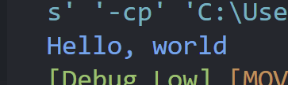
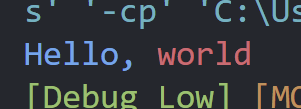

_**@Author:** [William J. Horn](https://github.com/william-horn)_

# _class_ `Console`

A static library class that can be used for printing, getting user input, applying console text colors, and accessing the debug API methods.

## Printing

The `print` method and children are accessed directly through the `Console` class:

```java
Console.println("Hello, world");
```

All content spearated by a comma `,` will concatenate with a comma:

```java
Console.println("Hello", "world");
```

> \> Hello, world

### Colors

To apply console colors, prefix your text with `$text-COLOR` and `$bg-COLOR` followed by a space, and then your content. The available colors to choose from are:

- black
- red
- green
- yellow
- blue
- purple
- cyan
- white
- bright_black
- bright_red
- bright_green
- bright_yellow
- bright_blue
- bright_purple
- bright_cyan
- bright_white

#### Example:

```java
Console.println("$text-blue Hello, world");
```



<br/>

Colors can also be overrided by inserting another `$` directive anywhere after a previous directive:

```java
Console.println("$text-blue Hello, $text-red world");
```



<br/>

To return the text color or background color back to it's default state, use `$text-reset` or `$bg-reset`, respectively.

These console colors also work for all other children of the print method:

- `Console.print()`
- `Console.error()`

## Debug tools

The `Console` class will have many more debugging tools in the future, but for now it's limited to debug printing and some configuration options.

### `Console.debugPrint()`

Debug print behaves like `Console.println()`, except it is influenced by the debug controls in the `Console` class. This means that debug-printed messages can be toggled on and off, simply by configuring the `Console` class.

#### Example:

```java
Console.debugPrint("Some warning message");
```

This message will only print to the output console if debug mode is enabled, like such:

```java
Console.setDebugModeEnabled(true);
```

Also, the message will be displayed in the output console with the following prefix of:

> \> [Debug Low]: Some warning message

This is because debug printing comes with 3 levels of display priority, all of which are enabled by default:

- `DebugPriority.LOW`
- `DebugPriority.MEDIUM`
- `DebugPriority.HIGH`

_If no `DebugPriority` is passed to `Console.debugPrint(...)`, then `DebugPriority.LOW` is given by default._

To explicitly assign a debug priority level to a printed message, pass the `DebugPriority` enum as the first argument:

```java
Console.debugPrint(DebugPriority.HIGH, "Emergency message");
```

This will assign the debug message to a `HIGH` priority. Individual priority levels can be enabled or disabled at will using `hideDebugPriority()` and `showDebugPriority()`

### `Console.hideDebugPriority()`

**args:**

- **DebugPriority** debugPriority

A parameter must be specified to choose a specific debug priority to hide in the output console. For example:

```java
Console.hideDebugPriority(DebugPriority.LOW);

Console.debugPrint("Low priority, won't show");
Console.debugPrint(DebugPriority.HIGH, "High priority, will show");
```

### `Console.showDebugPriority()`

**args:**

- **DebugPriority** debugPriority

Like with `hideDebugPriority()`, a debug priority enum is required to enable that priority level to be displated in the output again.

```java
// Hide LOW and HIGH
Console.hideDebugPriority(DebugPriority.LOW);
Console.hideDebugPriority(DebugPriority.HIGH);

// Show LOW
Console.showDebugPriority(DebugPriority.LOW);

Console.debugPrint("Low priority will show");
Console.debugPrint(DebugPriority.HIGH, "High priority will not show");
```

### `Console.setDebugPriority()`

You can also show debug priority levels exclusively, using `Console.setDebugPriority()`

```java
Console.setDebugPriority(DebugPriority.MEDIUM);

Console.debugPrint("Low priority will not show");
Console.debugPrint(DebugPriority.HIGH, "High priority will not show");
Console.debugPrint(DebugPriority.MEDIUM, "Medium priority, will show");
```

> \> Medium priority, will show
